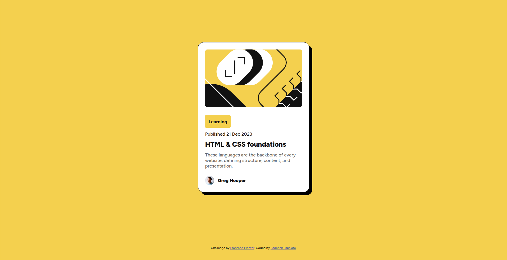

# Frontend Mentor - Blog preview card solution

This is a solution to the [Blog preview card challenge on Frontend Mentor](https://www.frontendmentor.io/challenges/blog-preview-card-ckPaj01IcS). Frontend Mentor challenges help you improve your coding skills by building realistic projects.

## Table of contents

- [Overview](#overview)
  - [The challenge](#the-challenge)
  - [Screenshot](#screenshot)
  - [Links](#links)
- [My process](#my-process)
  - [Built with](#built-with)
  - [What I learned](#what-i-learned)
  - [Continued development](#continued-development)
  - [Useful resources](#useful-resources)
- [Author](#author)

## Overview

### The challenge

Users should be able to:

- See hover and focus states for all interactive elements on the page

### Screenshot



### Links

- Solution URL: [Add solution URL here](https://your-solution-url.com)
- Live Site URL: [Add live site URL here](https://your-live-site-url.com)

## My process

### Built with

- Semantic HTML5 markup
- CSS custom properties
- Flexbox
- CSS grid

### What I learned

In this section of code I'm using semantic HTML it makes the presentation of HTML markup more refine. Semantic clearly describes its meaning to the browser and developer.

Code snippets:

```html
<main class="container">
  <article class="blog-card"></article>
  <footer></footer>
</main>
```

In this section of code I found CSS custom properties helpful so I can define any CSS classes to define the properties with a fixed value.

```css
/* Theme Variables (Colors, Typography) */
:root {
  /* Colors */
  --color-bg-primary: hsl(47, 88%, 63%);
  --color-bg-card: hsl(0, 0%, 100%);
  --color-text-muted: hsl(0, 0%, 42%);
  --color-text-dark: hsl(0, 0%, 7%);
  --color-link: hsl(228, 45%, 44%);

  /* Typography Sizes */
  --font-size-lg: 1.5rem;
  --font-size-md: 1rem;
  --font-size-sm: 0.875rem;

  /* Typography Weights */
  --font-weight-bold: 700;
  --font-weight-medium: 500;
  --font-weight-xbold: 800;
}

/* Utility Classes */
.text-lg {
  font-size: var(--font-size-lg);
}
.text-md {
  font-size: var(--font-size-md);
}
.text-sm {
  font-size: var(--font-size-sm);
}
```

In this section of code I learned about pseudo-classes to interact with different states of elements. It helped me achieve changing the color of the blog title when hovering over the blog preview card.

```css
/* Blog Title Hover, Active and Focus Effect */
article:is(:hover, :active, :focus) .blog-title {
  color: var(--color-bg-primary);
  transition: color 0.3s ease-out;
}
```

In this section of code media queries makes website responsive by applying different styles for different media types/devices.

```css
/* Responsive: Mobile View */
@media only screen and (max-width: 375px) {
  article {
    width: 90%;
    height: auto;
  }
}
```

### Continued development

In my future projects semantic HTML, and CSS custom properties are concepts I've found interesting. I want to learn more about it and apply it to the next projects.

### Useful resources

- [CSS Flexbox Layout Guide](https://css-tricks.com/snippets/css/a-guide-to-flexbox/) - This helped me for achieve column layout for the items in blog preview card.
- [CSS custom properties](https://developer.mozilla.org/en-US/docs/Web/CSS/CSS_cascading_variables/Using_CSS_custom_properties) - This is an amazing documentation which helped me finally understand how custom properties work and use it globally within CSS. I'd recommend it to anyone still learning this concept.
- [CSS box-shadow](https://www.w3schools.com/cssref/css3_pr_box-shadow.php) - This helped me achieve shadow effect with blog preview card.
- [CSS media queries](https://www.w3schools.com/css/css_rwd_mediaqueries.asp) - Media queries makes website responsive for web/mobile view.

## Author

- Frontend Mentor - [https://www.frontendmentor.io/profile/federick-pabalate](https://www.frontendmentor.io/profile/federick-pabalate)
- Github - [https://github.com/federick-pabalate](https://github.com/federick-pabalate)
